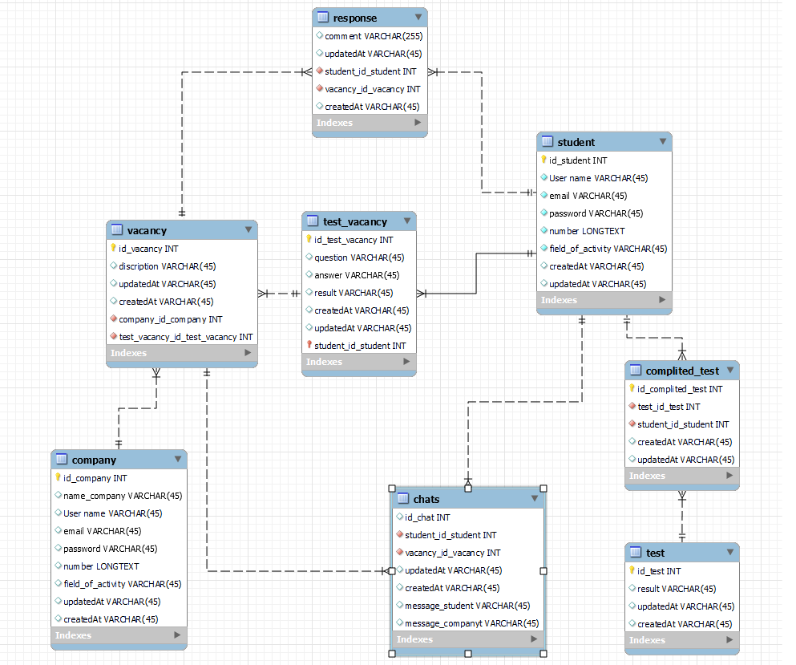
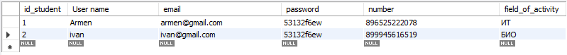
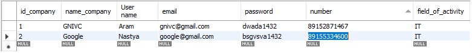

# REST API.




## Клиенты REST API

Клиенты REST API:
- Мобильное приложение
- Web-интерфейс администратора
- Web-интерфейс потзователя
- Сторонняя система "ГосУслуг"
- Система автоматизации

## Роли

- Пользователь;
- Компания;
- Система.
  
# Запросы и ответы

## Регистрация пользователя


Пример запроса:

`POST/sudent`
```json
{
  "User name": "Ivan",
  "email": "ivan@gmail.com",
  "password": "53132f6ew"
}
```
Пример ответа:

```json
{
  "id_student": "1",
  "User name": "Ivan",
  "email": "ivan@gmail.com",
  "password": "53132f6ew",
  "createdAt": "2022-06-22T11:40:00Z",
  "updatedAt": "2022-06-22T11:40:00Z"
}
```
Запрос доступен для ролей: Cистема,регистрация пользователя.

## Обновление данных пользователя
`PUTCH/student/1`
Пример ответа:

```json
{
  "User name": "Ivan",
  "email": "ivan@gmail.com",
  "password": "53132f6ew",
  "createdAt": "2022-06-22T11:40:00Z",
  "updatedAt": "2022-06-22T11:40:00Z"
}
```
Запрос доступен для ролей: Обновление данных пользователя


## Регистация компании
 

 `POST/company`
```json
{
  "name_company": "GNIVC",
  "User name": "Aram",
  "email": "gnivc@gmail.com",
  "password": "dwada1432"
}
```
Пример ответа:

```json
{
  "id_company": "1",
  "name_company": "GNIVC",
  "User name": "Aram",
  "email": "gnivc@gmail.com",
  "password": "dwada1432",
  "createdAt": "2022-06-22T11:40:00Z",
  "updatedAt": "2022-06-22T11:40:00Z"
}
```
Запрос доступен для ролей: Cистема,регистрация компании.

## Обновление данных компании
`PUTCH/company/1`
Пример ответа:

```json
{
  "name_company": "GNIVC",
  "User name": "Aram",
  "email": "gnivc@gmail.com",
  "password": "dwada1432",
  "createdAt": "2022-06-22T11:40:00Z",
  "updatedAt": "2022-06-22T11:40:00Z"
}
```
Запрос доступен для ролей: Обновление данных компании.

## Авторизация
 

 `GET/(company/student)`
```json
{
  "name_company": "GNIVC",
  "name_student": "Ivan",
  "User name": "Aram",
  "email": "gnivc@gmail.com",
  "password": "dwada1432"
}
```
Пример ответа:

```json
{
  "id_student": "1",
  "id_company": "1",
  "name_company": "GNIVC",
  "User name": "Aram",
  "email": "gnivc@gmail.com",
  "password": "dwada1432",
  "createdAt": "2022-06-22T11:40:00Z",
  "updatedAt": "2022-06-22T11:40:00Z"
}
```
Запрос доступен для ролей: Cистема авторизации.

## Созданиие вакансии
`POST/vacancy`
```json
{
  "name_vacancy": "Бизнес-аналитик",
  "name_company": "GNIVC",
  "dicripsion": "Предоставляем хорошие условия труда",
}
```

Пример ответа:
```json
{
  "id_vacancy": "1",
  "name_company": "GNIVC",
  "name_vacancy": "Аналитик",
  "dicripsion": "Предоставляем хорошие условия труда",
  "createdAt": "2022-06-22T11:40:00Z",
  "updatedAt": "2022-06-22T11:40:00Z"
}
```
Запрос доступен для ролей: Cистема создания вакансии.

## Получение данных о вакансии
`GET/vacancy/1`

Пример ответа:
```json
{
  "id_vacancy": "1",
  "name_company": "GNIVC",
  "name_vacancy": "Аналитик",
  "dicripsion": "Предоставляем хорошие условия труда",
  "createdAt": "2022-06-22T11:40:00Z",
  "updatedAt": "2022-06-22T11:40:00Z"
}
```
Запрос доступен для ролей: Cистема получений данных вакансии.

## Отклик на ваканию
`POST/respone/1`

```json
{
  "id_vacancy": "1",
  "id_student": "1"
}
```

Пример ответа:

```json
{
  "comment": "Откликнулся",
  "createdAt": "2022-06-22T11:40:00Z",
  "updatedAt": "2022-06-22T11:40:00Z"
}
```
Запрос доступен для ролей: Отклик на вакансию.

## Создание теста на вакансию
Пример запроса:

`POST/test_vacancy/1`
```json
{
  "question": "Что делает бизнес-аналитик?",
  "anwer": " Аналитик собирает данные и доносит их разработчику",
  "result": "5",
}
```
Пример ответа:

```json
{
  "id_test_vacancy": "1",
  "id_student": "1",
  "result": "5",
  "question": "Что делает бизнес-аналитик?",
  "anwer": " Аналитик собирает данные и доносит их разработчику",
  "createdAt": "2022-06-22T11:40:00Z",
  "updatedAt": "2022-06-22T11:40:00Z"
}
```
Запрос доступен для ролей: Cистема создания теста.

## Обновление теста
Пример запроса:

`PUT/test_vacancy/1`
```json
{
  "id_test_vacancy": "1",
  "question": "Что делает бизнес-аналитик?",
  "anwer": " Аналитик собирает данные и доносит их разработчику"
}
```
Пример ответа:

```json
{
  "id_test_vacancy": "1",
  "id_student": "1",
  "result": "5",
  "question": "Что делает бизнес-аналитик?",
  "anwer": " Аналитик собирает данные и доносит их разработчику",
  "createdAt": "2022-06-22T11:40:00Z",
  "updatedAt": "2022-06-22T11:40:00Z"
}
```
Запрос доступен для ролей: Cистема обновленния данных теста.

## Чат

`GET/chats`
```json
{
  "id_student": "1",
  "id_company": "1",
  "message_student": "Я хочу устроиться к вам на стажировку",
  "message_company": "Почему вы хотите устроиться к нам на стажировку"
}
```
Пример ответа:

```json
{
  "id_chats": "1",
  "id_student": "1",
  "id_company": "1",
  "createdAt": "2022-06-22T11:40:00Z",
  "updatedAt": "2022-06-22T11:40:00Z"
}
```
Запрос доступен для ролей: Cистема чата.
