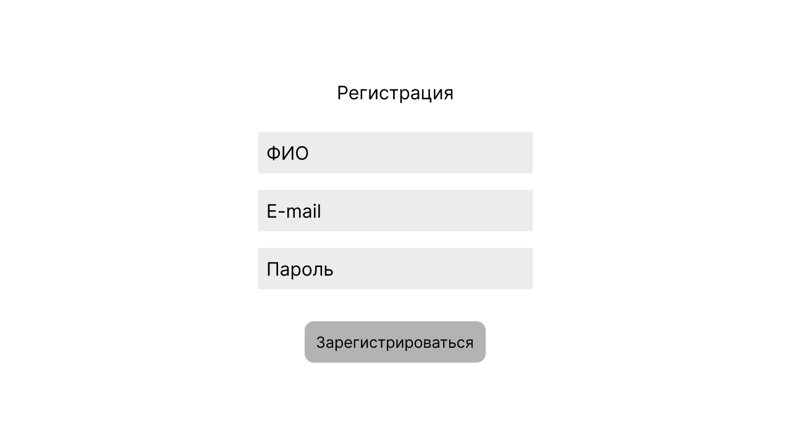

# 1. ОПИСАНИЕ ПОЛЬЗОВАТЕЛЬСКИХ ИНТЕРФЕЙСОВ
*[В данном разделе необходимо спроектировать макеты основных экранных форм системы и описать имеющиеся на них структурные элементы интерфейса. Если это веб-приложение, обязательно предоставляется макет и описание главной страницы, а также основных страниц и форм сайта. Если это desktop-приложение, предоставляется макет и описание главного окна и прочих важных окон, карточек элементов.]* 

## 1.1.	<Регистрация ученика>

| № п/п | Наименование элемента | Тип элемента | Назначение элемента | Описание, комментарии, ограничения |
|----|:----:|----|----|----|
| 1 | ФИО | *Текстовое поле* | *Поле для ввода ФИО* |  |
| 2 | Email | *Текстовое поле* | *Поле для ввода электронной почты* | *Пример заполнения: someone@example.com* |
| 3 | Пароль | *Поле пароля* | *Поле для ввода пароля* | Автоматически скрывает символы, заменяя их на точки |
| 4 | Зарегистрироваться | *Кнопка* | *По нажатию происходит переадресация на сайт* | 1. Если какое-то поле не заполнено, то выходит сообщение об ошибке 2. Если email уже был зарегистрирован, то выходит строка с уведомлением|
| 5 | Зарегистрироваться с помощью Госуслуг | *Кнопка* | *По нажатию происходит переадресация на сайт Госуслуг для авторизации* | Пользователь должен быть зарегистрирован на сайте Госуслуг |
| 6 | Войти | *Ссылка* | *По нажатию происходит переадресация на окно авторизации* |  |

## 1.2.	<Регистрация работодателя>

| № п/п | Наименование элемента | Тип элемента | Назначение элемента | Описание, комментарии, ограничения |
|----|:----:|----|----|----|
| 1 | Название компании | *Текстовое поле* | *Поле для ввода наименования компании* |  |
| 2 | ФИО | *Текстовое поле* | *Поле для ввода ФИО сотрудника* |  |
| 3 | Email | *Текстовое поле* | *Поле для ввода электронной почты* | *Пример заполнения: someone@example.com* |
| 4 | Пароль | *Поле пароля* | *Поле для ввода пароля* | Автоматически скрывает символы, заменяя их на точки |
| 5 | Зарегистрироваться | *Кнопка* | *По нажатию происходит переадресация на сайт* | 1. Если какое-то поле не заполнено, то выходит сообщение об ошибке 2. Если email уже был зарегистрирован, то выходит строка с уведомлением|
| 6 | Зарегистрироваться с помощью Госуслуг | *Кнопка* | *По нажатию происходит переадресация на сайт Госуслуг для авторизации* | Пользователь должен быть зарегистрирован на сайте Госуслуг |
| 7 | Войти | *Ссылка* | *По нажатию происходит переадресация на окно авторизации* |  |

## 1.3.	<Авторизация>

| № п/п | Наименование элемента | Тип элемента | Назначение элемента | Описание, комментарии, ограничения |
|----|:----:|----|----|----|
| 1 | Email | *Текстовое поле* | *Поле для ввода электронной почты* | *Пример заполнения: someone@example.com* |
| 2 | Пароль | *Поле пароля* | *Поле для ввода пароля* | Автоматически скрывает символы, заменяя их на точки |
| 3 | Войти | *Кнопка* | *По нажатию происходит переадресация на сайт* | 1. Если какое-то поле не заполнено, то выходит сообщение об ошибке 2. Если email неверный, то выходит сообщение об ошибке 3.Если пароль неверный, то выходит сообщение об ошибке|
| 4 | Авторизоваться через Госуслуги | *Кнопка* | *По нажатию происходит переадресация на сайт Госуслуг для авторизации* | Пользователь должен быть зарегистрирован на сайте Госуслуг |
| 5 | Забыли пароль? | *Кнопка* | *По нажатию происходит переадресация на сайт для восстановления пароля* |  |

## 1.3.	<Просмотр списка вакансий>

| № п/п | Наименование элемента | Тип элемента | Назначение элемента | Описание, комментарии, ограничения |
|----|:----:|----|----|----|
| 1 | Личный кабинет | *Кнопка* | *Открытие профиля пользователя* |  |
| 2 | Избранное | *Кнопка* | *Открытие списка избранных ваканский* |  |
| 3 | Тесты на профориентацию | *Кнопка* | *Открытие раздела с тестами на профориентацию* | |
| 4 |Чат | *Кнопка* | *По нажатию происходит открытие раздела чата с работодателями* | Пользователь должен быть зарегистрирован на сайте Госуслуг |
| 5 | Поиск | *Кнопка* | *По нажатию происходит переадресация на сайт для восстановления пароля* |  |
