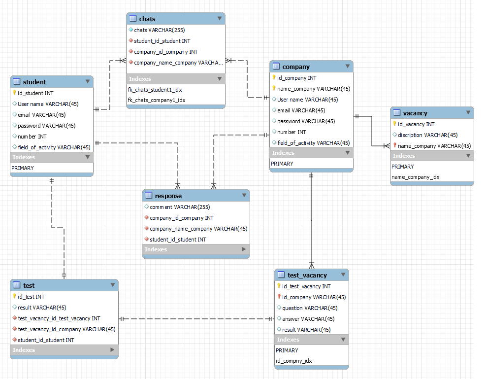

# REST API


*[В данном разделе необходимо спроектировать REST API для создаваемой системы.]*

## Клиенты REST API

*[Здесь требуется перечислить, кто будет клиентом для разрабатываемого серверного REST API. Это могут быть как приложения, входящие в состав нашей системы, так и сторонние системы. Пример ниже.]*

Клиенты REST API:
- Мобильное приложение
- Web-интерфейс администратора
- Сторонняя система АИС "Издательство"

## Роли

*[Здесь требуется привести список ролей для нашего REST API]*

- Анонимный пользователь;
- Зарегистрированный пользователь;
- Редактор;
- Администратор.

## Запросы и ответы


*[Ниже вы видите пример, как требуется описать запросы, поддерживаемые вашим API. Опишите таким образом все запросы. Для запросов POST, PUT, PATCH следует также привести тело запроса ("он же - пример запроса", по аналогии с примером ответа). ]*

### Получение заданного поста по его идентификатору


`POST /student

# Регистрация пользователя


Пример запроса:

`POST/sudent
```json
{
  "User name": "Ivan",
  "email": "ivan@gmail.com",
  "password": "53132f6ew",
}
```
Пример ответа:

```json
{
  "id_student": "1",
  "User name": "Ivan",
  "email": "ivan@gmail.com",
  "password": "53132f6ew",
  "createdAt": "2022-06-22T11:40:00Z",
  "updatedAt": "2022-06-22T11:40:00Z"
}
```
# Регистация компании
 

 `POST/company
```json
{
  "name_company": "GNIVC",
  "User name": "Aram",
  "email": "gnivc@gmail.com",
  "password": "dwada1432",
}
```
Пример ответа:

```json
{
  "id_student": "1",
  "name_company": "GNIVC",
  "User name": "Aram",
  "email": "gnivc@gmail.com",
  "password": "dwada1432",
  "createdAt": "2022-06-22T11:40:00Z",
  "updatedAt": "2022-06-22T11:40:00Z"
}
```


]